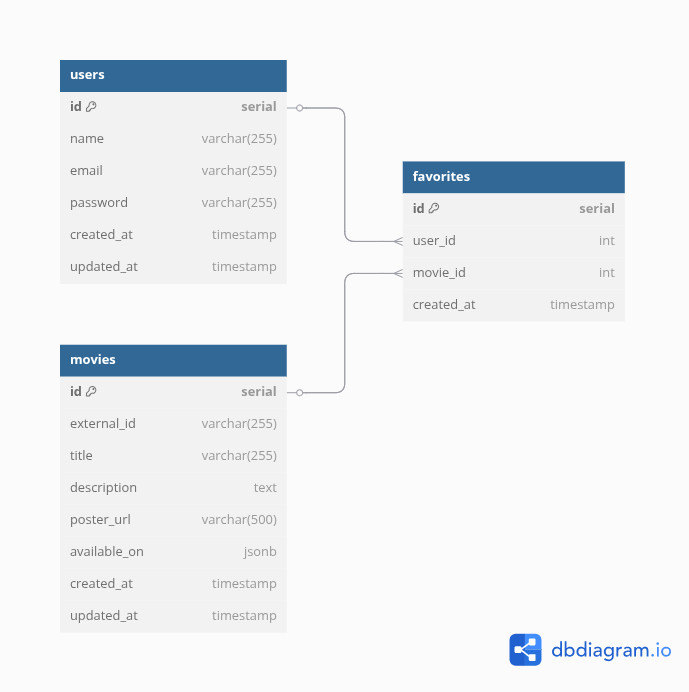

<p align="center">
  
</p>

<h1 align="center">Onde Assistir API</h1>
<p align="center">Encontre onde seu filme preferido está disponível.</p>


## Descrição
A API Onde Assistir? é responsável por buscar informações sobre filmes e séries, verificando em quais plataformas de streaming esses conteúdos estão disponíveis, como Netflix, Prime Video, MAX, entre outros. A API atua como intermediária entre o front-end e a API externa de disponibilidade de streaming, centralizando e controlando as requisições. Além disso, permite o gerenciamento de usuários e de seus filmes favoritos, armazenando localmente os detalhes dos filmes salvos para consultas futuras. O projeto é desenvolvido com NestJS e utiliza PostgreSQL como banco de dados.

**Responsável: Matheus Rocha Camargo**

## Checklist de funcionalidades
- RA1 - Projetar e desenvolver uma API funcional utilizando o framework NestJS.
  - [ ] ID1: O aluno configurou corretamente o ambiente de desenvolvimento e criou a API utilizando NestJS, com rotas e controladores que seguem a arquitetura modular.
  - [ ] ID2: O aluno aplicou boas práticas de organização da lógica de negócios, garantindo que os services contenham a lógica de negócio e sejam chamados pelos controladores, separando responsabilidades corretamente.
  - [ ] ID3: O aluno utilizou providers e configurou adequadamente a injeção de dependência no NestJS, garantindo uma arquitetura modular e escalável.
  - [ ] ID4: O aluno demonstrou a habilidade de criar e manipular rotas HTTP, manipulando parâmetros de rota, query e body, lidando corretamente com requisições e respostas.
  - [ ] ID5: O aluno aplicou boas práticas de tratamento de erros, utilizando filtros globais e personalizando as mensagens de erro para garantir respostas claras e consistentes.
  - [ ] ID6: O aluno criou classes DTO (Data Transfer Objects) para garantir a validação e consistência dos dados em diferentes endpoints, utilizando pipes para validar entradas de dados.
  - [ ] ID7: O aluno aplicou corretamente pipes de validação no NestJS, verificando entradas inválidas e assegurando a integridade dos dados transmitidos

- RA2 - Implementar persistência de dados com um banco de dados relacional utilizando Prisma ou TypeORM.
  - [ ] ID8: O aluno modelou corretamente os dados da aplicação, definindo entidades, suas relações e campos necessários, refletidos em um Diagrama de Entidade-Relacionamento (ERD).
  - [ ] ID9: O aluno configurou e conectou a API a um banco de dados relacional (PostgreSQL, MySQL, etc.) utilizando Prisma ou TypeORM.
  - [ ] ID10: O aluno criou e aplicou migrações de banco de dados para garantir a consistência dos dados entre desenvolvimento e produção.
  - [ ] ID11: O aluno implementou corretamente as operações CRUD (Create, Read, Update, Delete) para pelo menos uma entidade no projeto, utilizando NestJS.
- RA3 - Realizar testes automatizados para garantir a qualidade da API.
  - [ ] ID12: O aluno implementou testes automatizados (unitários ou de integração) utilizando Jest, validando funcionalidades críticas da API.
  - [ ] ID13: O aluno garantiu a cobertura de testes para, pelo menos, as principais rotas e serviços da API, incluindo operações CRUD.

- RA4 - Gerar a documentação da API e realizar o deploy em um ambiente de produção.
  - [ ] ID14: O aluno integrou corretamente o Swagger à API, gerando a documentação completa e interativa dos endpoints, parâmetros e respostas da API, com exemplos de requisições e respostas.
  - [ ] ID15: O aluno realizou o deploy da API em uma plataforma de hospedagem na nuvem (ex.: Render.com, Heroku, Vercel, etc.), garantindo que a API estivesse acessível publicamente.
  - [ ] ID16: O aluno garantiu que a API funcionasse corretamente no ambiente de produção, incluindo a documentação Swagger e o banco de dados.
  - [ ] ID17: O aluno realizou a configuração correta de variáveis de ambiente usando o ConfigModule do NestJS.
  - [ ] ID18: O aluno implementou corretamente o versionamento de APIs REST no NestJS, assegurando que diferentes versões da API pudessem coexistir.

- RA5 - Implementar autenticação, autorização e segurança em APIs utilizando JWT, Guards, Middleware e Interceptadores.
  - [ ] ID19: O aluno configurou a autenticação na API utilizando JWT (JSON Web Tokens).
  - [ ] ID20: O aluno implementou controle de acesso baseado em roles e níveis de permissão, utilizando Guards para verificar permissões em rotas específicas.
  - [ ] ID21: O aluno configurou e utilizou middleware para manipular requisições antes que elas chegassem aos controladores, realizando tarefas como autenticação, logging ou tratamento de CORS.
  - [ ] ID22: O aluno implementou interceptadores para realizar logging ou modificar as respostas antes de enviá-las ao cliente.

## Link para a API em Produção
*Em breve*

## Instruções de execução

Instale as depednências do projeto
```bash
$ npm install
```

Compile e execute o projeto

```bash
# Desenvolvimento
$ npm run start

# Modo watcher
$ npm run start:dev

# Modo em produção
$ npm run start:prod
```

Executar testes

```bash
# Testes uniários
$ npm run test

# Testes end 2 end
$ npm run test:e2e

# Testes de coverage
$ npm run test:cov
```


## Diagrama entidade-relacionamento


## Documentação Swagger
*Em breve* 

## Deployment

When you're ready to deploy your NestJS application to production, there are some key steps you can take to ensure it runs as efficiently as possible. Check out the [deployment documentation](https://docs.nestjs.com/deployment) for more information.

If you are looking for a cloud-based platform to deploy your NestJS application, check out [Mau](https://mau.nestjs.com), our official platform for deploying NestJS applications on AWS. Mau makes deployment straightforward and fast, requiring just a few simple steps:

```bash
$ npm install -g @nestjs/mau
$ mau deploy
```

With Mau, you can deploy your application in just a few clicks, allowing you to focus on building features rather than managing infrastructure.

## Resources

Check out a few resources that may come in handy when working with NestJS:

- Visit the [NestJS Documentation](https://docs.nestjs.com) to learn more about the framework.
- For questions and support, please visit our [Discord channel](https://discord.gg/G7Qnnhy).
- To dive deeper and get more hands-on experience, check out our official video [courses](https://courses.nestjs.com/).
- Deploy your application to AWS with the help of [NestJS Mau](https://mau.nestjs.com) in just a few clicks.
- Visualize your application graph and interact with the NestJS application in real-time using [NestJS Devtools](https://devtools.nestjs.com).
- Need help with your project (part-time to full-time)? Check out our official [enterprise support](https://enterprise.nestjs.com).
- To stay in the loop and get updates, follow us on [X](https://x.com/nestframework) and [LinkedIn](https://linkedin.com/company/nestjs).
- Looking for a job, or have a job to offer? Check out our official [Jobs board](https://jobs.nestjs.com).

## Support

Nest is an MIT-licensed open source project. It can grow thanks to the sponsors and support by the amazing backers. If you'd like to join them, please [read more here](https://docs.nestjs.com/support).

## Stay in touch

- Author - [Kamil Myśliwiec](https://twitter.com/kammysliwiec)
- Website - [https://nestjs.com](https://nestjs.com/)
- Twitter - [@nestframework](https://twitter.com/nestframework)

## License

Nest is [MIT licensed](https://github.com/nestjs/nest/blob/master/LICENSE).
